# Distributed Payment Processing System

A cloud-native, microservices-based payment processing platform built with resilience, scalability, and PCI-DSS compliance. Processes 10,000+ transactions/min with fraud detection, real-time reconciliation, and multi-channel notifications.

## Architecture Overview

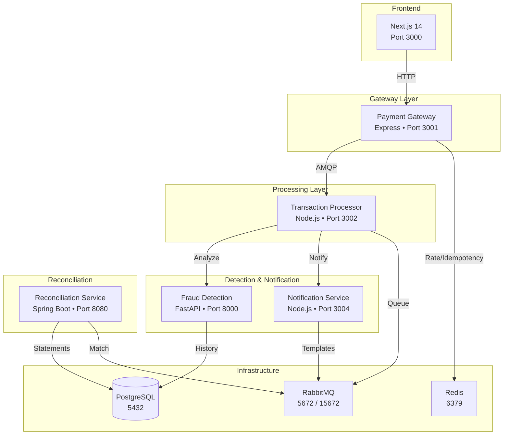

## Technology Stack

| Service | Language | Framework | Database | Message Queue | Key Libraries |
|---------|----------|-----------|----------|---------------|---------------|
| **Frontend** | TypeScript | Next.js 14, TailwindCSS | - | - | recharts, lucide-react |
| **Payment Gateway** | TypeScript | Express 4 | Redis | RabbitMQ | helmet, cors, express-rate-limit |
| **Transaction Processor** | TypeScript | Node.js 20 | Redis | RabbitMQ | amqplib, uuid |
| **Fraud Detection** | Python 3.11 | FastAPI | PostgreSQL, Redis | - | scikit-learn, pydantic, asyncpg |
| **Reconciliation** | Java 17 | Spring Boot 3.2 | PostgreSQL | RabbitMQ | Quartz, Hibernate, JPA |
| **Notification** | TypeScript | Node.js 20 | - | RabbitMQ | Handlebars, nodemailer |
| **Infrastructure** | - | Docker/K8s | PostgreSQL 16 | RabbitMQ 3.13 | Redis 7 |

## System Architecture Detail

### Frontend (Next.js 14 — Port 3000)

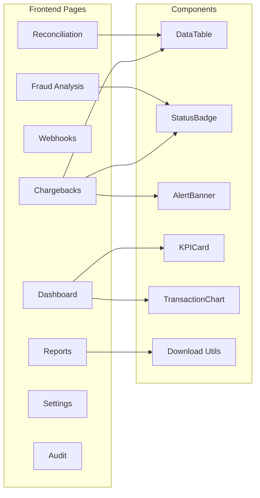

**Pages:**
| Route | Description | Features |
|-------|-------------|----------|
| `/dashboard` | Real-time KPI overview | Transaction volume, success rate, fraud rate, charts |
| `/reports` | Financial report generation | PDF/CSV/Excel export, scheduled reports |
| `/webhooks` | Webhook endpoint management | Create/test/delete, event filtering, secret management |
| `/chargebacks` | Dispute management | Evidence upload, response submission, status workflow |
| `/fraud-analysis` | Fraud alert investigation | Risk scoring, rule triggers, manual review workflow |
| `/reconciliation` | Bank statement matching | Drag-drop upload, discrepancy resolution, settlement status |
| `/settings` | System configuration | Rule engine config, fee schedules, user management |
| `/audit` | Audit log viewer | Filterable log search, user action tracking |

**Shared Components:**
- `DataTable` — Generic sortable/paginated table with typed columns
- `StatusBadge` — Color-coded status indicators with pulse animation
- `AlertBanner` — Dismissable warning/info/error banners
- `Toast` — Notification system (success/error/info)
- `DashboardLayout` — Consistent shell with navigation

### Payment Gateway (Express — Port 3001)

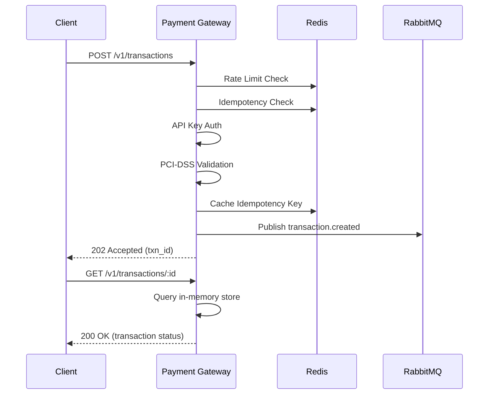

**Endpoints:**

| Method | Path | Auth | Description |
|--------|------|------|-------------|
| `POST` | `/v1/transactions` | API Key | Create & authorize transaction |
| `GET` | `/v1/transactions/:id` | API Key | Get transaction status |
| `POST` | `/v1/transactions/:id/capture` | API Key | Capture authorized amount |
| `POST` | `/v1/transactions/:id/cancel` | API Key | Cancel pending transaction |
| `POST` | `/v1/transactions/:id/refund` | API Key | Refund captured transaction |
| `POST` | `/v1/tokens` | API Key | Create payment token |
| `GET` | `/v1/tokens/:id` | API Key | Retrieve token details |
| `POST` | `/v1/webhooks/register` | API Key | Register webhook endpoint |
| `GET` | `/v1/webhooks` | API Key | List registered webhooks |
| `DELETE` | `/v1/webhooks/:id` | API Key | Unregister webhook |
| `GET` | `/health` | None | Health check |

**Security Layers (in order):**
1. **Helmet** — HTTP security headers (CSP, HSTS, X-Frame-Options)
2. **CORS** — Cross-origin resource sharing
3. **JSON Body Parser** — 1MB limit
4. **Rate Limiter** — 100 req/min per IP (express-rate-limit)
5. **Idempotency** — 24h Redis-backed idempotency key cache
6. **API Key Authentication** — HMAC signature verification
7. **PCI-DSS Validation** — Card number (13-19 digits), expiry (MM/YY), CVV (3-4 digits)
8. **Card Masking** — PAN masked to `****` + last 4 before downstream processing

### Transaction Processor (Node.js — Port 3002)

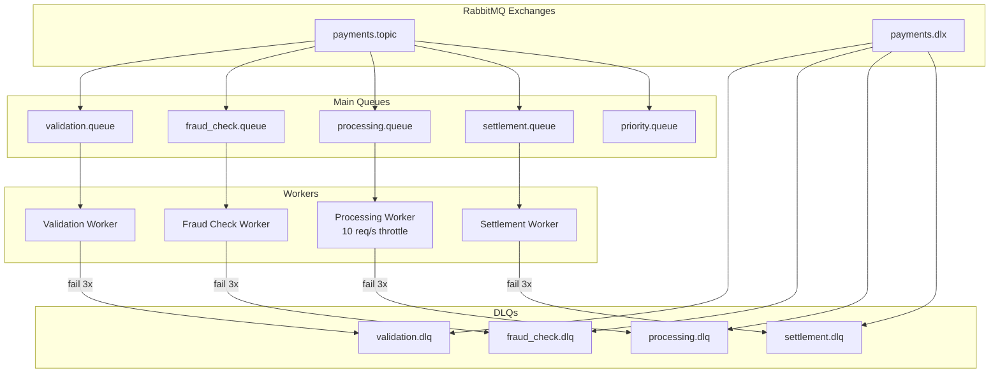

**Queue Architecture:**

| Queue | Binding Key | Workers | Retry | TTL | Priority |
|-------|-------------|---------|-------|-----|----------|
| `validation.queue` | `transaction.created` | 3 | 3x DLQ | 24h | Normal |
| `fraud_check.queue` | `transaction.fraud_check` | 2 | 3x DLQ | 24h | Normal |
| `processing.queue` | `transaction.process` | 5 | 3x DLQ | 24h | 10 req/s throttle |
| `settlement.queue` | `transaction.settle` | 2 | 3x DLQ | 24h | Normal |
| `priority.queue` | `transaction.priority` | 2 | 3x DLQ | 24h | >$10k txn |

**Saga Orchestrator (Distributed Transaction):**

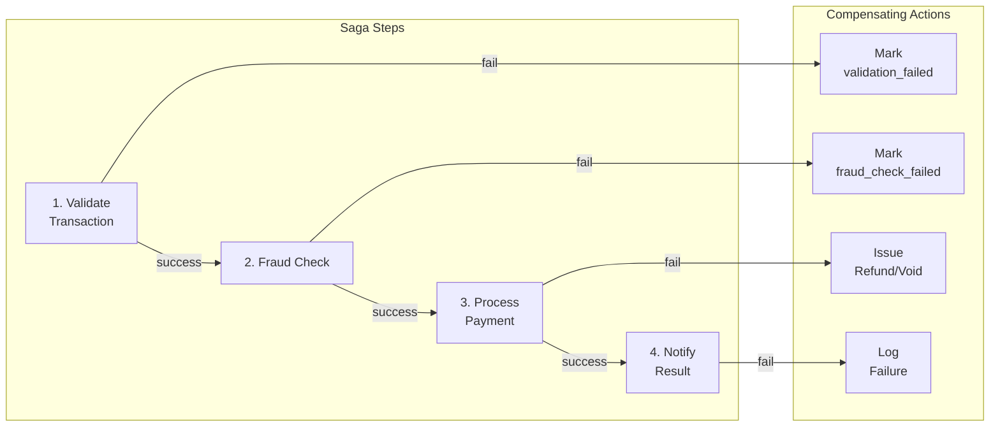

### Fraud Detection (FastAPI — Port 8000)

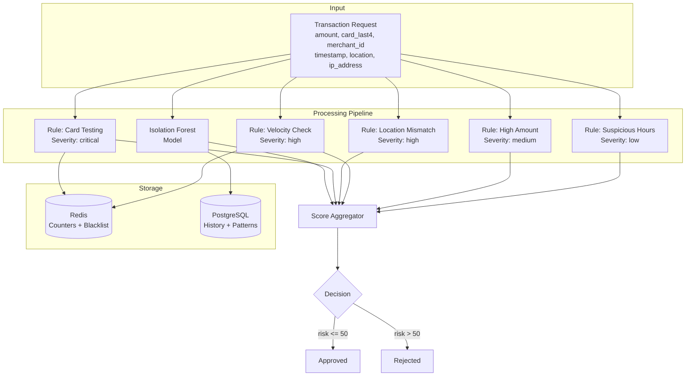

**Endpoints:**

| Method | Path | Description |
|--------|------|-------------|
| `POST` | `/analyze` | Analyze transaction for fraud |
| `GET` | `/score/{transaction_id}` | Get stored risk score |
| `POST` | `/report-fraud` | Report confirmed fraud |
| `GET` | `/patterns` | List detected fraud patterns |
| `GET` | `/health` | Health check |

**Request Schema (POST /analyze):**
```json
{
  "amount": 149.99,
  "card_last4": "1234",
  "merchant_id": "merchant_001",
  "timestamp": "2026-05-20T15:30:00Z",
  "location": "New York, NY",
  "customer_id": "cust_98765",
  "ip_address": "192.168.1.100"
}
```

**Response Schema:**
```json
{
  "transaction_id": "ff86bf3c-0496-40fb-be36-a85e7edb0a19",
  "risk_score": 27.5,
  "is_fraud": false,
  "triggered_rules": [],
  "ml_score": 0.9167,
  "decision": "approved"
}
```

**Deterministic Rules:**

| Rule | Condition | Score Contribution | Redis Key |
|------|-----------|-------------------|-----------|
| Suspicious Hours | 0:00-6:00 local time | +10 | - |
| High Amount | >$5,000 | +20 | - |
| Velocity | >10 txn/5min same merchant | +25 | `velocity:{merchant_id}` |
| Location Mismatch | IP/customer location mismatch | +30 | - |
| Card Testing | >20 failed attempts/15min | +40 | `card_testing:{ip}` |

**ML Model (Isolation Forest):**
- Trained on 10k synthetic samples at startup (2s training time)
- Features: amount, hour, day_of_week, velocity, location_distance, avg_amount_diff
- Model saved to disk and reloaded on restart
- Continuous retraining triggered after 1000 new reports

### Reconciliation Service (Spring Boot — Port 8080)

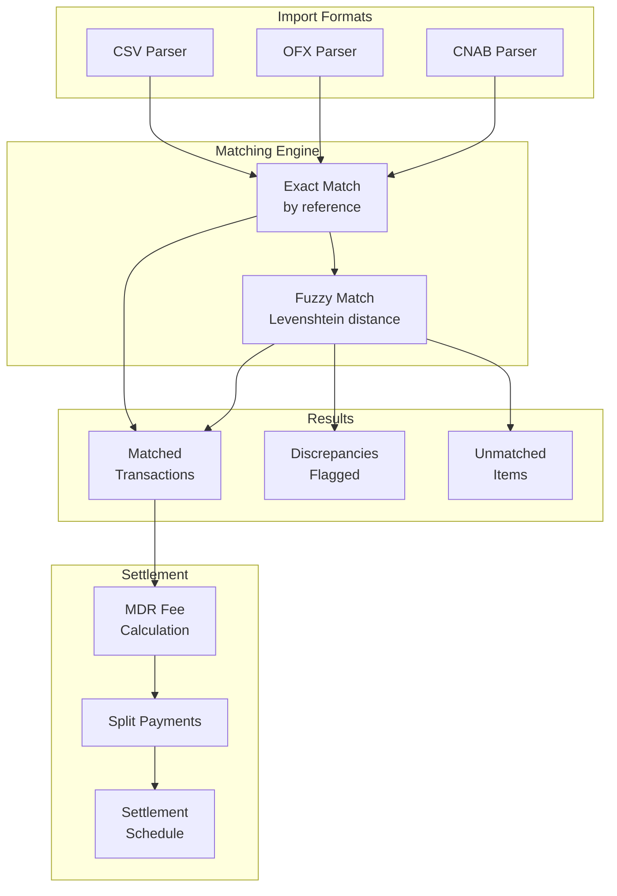

**Endpoints:**

| Method | Path | Description |
|--------|------|-------------|
| `POST` | `/api/reconciliation/import` | Import bank statement (CSV/OFX/CNAB) |
| `GET` | `/api/reconciliation/status` | Run reconciliation, return status |
| `GET` | `/api/reconciliation/discrepancies` | List all discrepancies |
| `POST` | `/api/reconciliation/discrepancies/{id}/approve` | Approve a discrepancy |
| `GET` | `/api/reconciliation/report` | Get daily reconciliation report |
| `GET` | `/api/settlements` | List all settlements |
| `GET` | `/api/settlements/schedule` | Settlement schedule |
| `POST` | `/api/settlements/process` | Process settlement batch |
| `POST` | `/api/settlements/calculate` | Calculate MDR + net amount |
| `POST` | `/api/settlements/split` | Split payment among recipients |
| `GET` | `/health` | Health check |

**Scheduled Jobs (Quartz):**

| Job | Cron | Description |
|-----|------|-------------|
| `DailyReconciliationJob` | 0 0 2 * * ? | Runs reconciliation at 2 AM daily |
| `WeeklyReportJob` | 0 0 8 * * MON | Generates weekly settlement report |

**Import Formats:**

| Format | Type | Fields |
|--------|------|--------|
| CSV | Text | `reference, amount, date, description` |
| OFX | QFX/OFX | Standard OFX tags (SGML/XML) |
| CNAB | CNAB240/400 | Brazilian banking standard |

### Notification Service (Node.js — Port 3004)

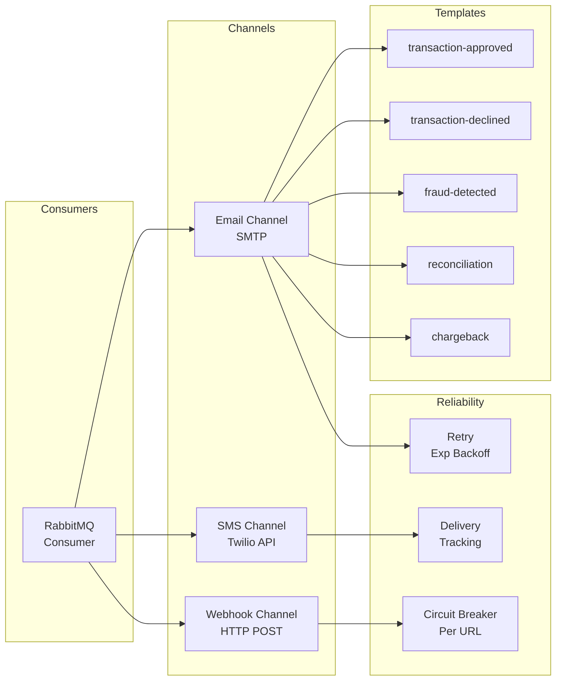

**Templates (Handlebars):**

| Template | Trigger | Channels |
|----------|---------|----------|
| `transaction-approved` | Transaction approved | Email, Webhook |
| `transaction-declined` | Transaction declined | Email, Webhook |
| `fraud-detected` | High-risk transaction | Email, SMS |
| `reconciliation` | Daily reconciliation complete | Email |
| `chargeback` | Chargeback received | Email |

## Transaction State Machine

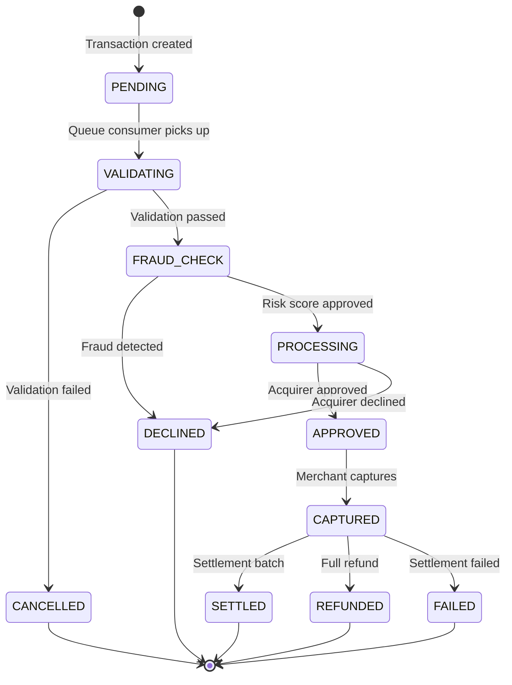

## Quick Start

### Prerequisites
- Docker Engine 24+ with Compose v2 plugin
- 8GB+ RAM allocated to Docker
- Git

### Start All Services

```bash
git clone <repo-url>
cd distributed-payment-system
docker compose up --build -d
```

Wait ~60s for all services to initialize (PostgreSQL, Redis, RabbitMQ health checks).

### Verify Everything is Running

```bash
# Check all containers
docker compose ps

# Test health endpoints
curl http://localhost:3000/health          # Frontend
curl http://localhost:3001/health          # Payment Gateway
curl http://localhost:3002/health          # Transaction Processor
curl http://localhost:8000/health          # Fraud Detection
curl http://localhost:3004/health          # Notification Service
curl http://localhost:8080/health          # Reconciliation
```

### Service URLs

| Service | URL | Auth |
|---------|-----|------|
| Frontend Dashboard | http://localhost:3000 | - |
| Payment Gateway API | http://localhost:3001 | `x-api-key: pk_test_abcdef123456` |
| Transaction Processor | http://localhost:3002 | - |
| Fraud Detection API | http://localhost:8000 | - |
| Reconciliation API | http://localhost:8080 | - |
| Notification Service | http://localhost:3004 | - |
| RabbitMQ Management | http://localhost:15672 | `guest` / `guest` |

## API Usage Examples

### Create a Payment Transaction

```bash
curl -X POST http://localhost:3001/v1/transactions \
  -H "Content-Type: application/json" \
  -H "x-api-key: pk_test_abcdef123456" \
  -d '{
    "amount": 150.00,
    "currency": "USD",
    "description": "Order #12345",
    "cardNumber": "4111111111111111",
    "cardExpiry": "12/28",
    "cardCvv": "123"
  }'
```

### Fraud Analysis

```bash
curl -X POST http://localhost:8000/analyze \
  -H "Content-Type: application/json" \
  -d '{
    "amount": 150.00,
    "card_last4": "1111",
    "merchant_id": "merchant_001",
    "customer_id": "cust_001",
    "timestamp": "2026-05-20T15:30:00Z",
    "location": "New York, NY",
    "ip_address": "192.168.1.1"
  }'
```

### Import Bank Statement for Reconciliation

```bash
curl -X POST http://localhost:8080/api/reconciliation/import \
  -H "Content-Type: application/json" \
  -d '{
    "format": "CSV",
    "content": "reference,amount,date,description\ntxn_1001,1250.00,2026-05-15,Payment",
    "fileName": "statement.csv"
  }'
```

## Load Testing

### Prerequisites

Install k6 or use Docker:

```bash
docker run --rm --network distributed-payment-system_payment-network \
  -v $(pwd)/k6:/scripts -i grafana/k6 \
  run /scripts/payment-gateway-test.js
```

### Available Scripts

| Script | Target | Stages | Thresholds |
|--------|--------|--------|------------|
| `k6/payment-gateway-test.js` | Payment Gateway (3001) | 30s ramp → 5min 100vu → 30s down | p95 < 500ms, errors < 1% |
| `k6/payment-gateway-spike-test.js` | Payment Gateway (3001) | 10s → 200vu, 30s hold, 10s down | p95 < 1000ms, errors < 5% |
| `k6/fraud-detection-test.js` | Fraud Detection (8000) | 30s ramp → 5min 100vu → 30s down | p95 < 500ms, errors < 1% |

### Running All Tests

```bash
# Payment gateway standard load
docker run --rm --network distributed-payment-system_payment-network \
  -v $(pwd)/k6:/scripts grafana/k6 run /scripts/payment-gateway-test.js

# Fradu detection load
docker run --rm --network distributed-payment-system_payment-network \
  -v $(pwd)/k6:/scripts grafana/k6 run /scripts/fraud-detection-test.js

# Spike test
docker run --rm --network distributed-payment-system_payment-network \
  -v $(pwd)/k6:/scripts grafana/k6 run /scripts/payment-gateway-spike-test.js
```

## Failure Handling

### Circuit Breaker Pattern

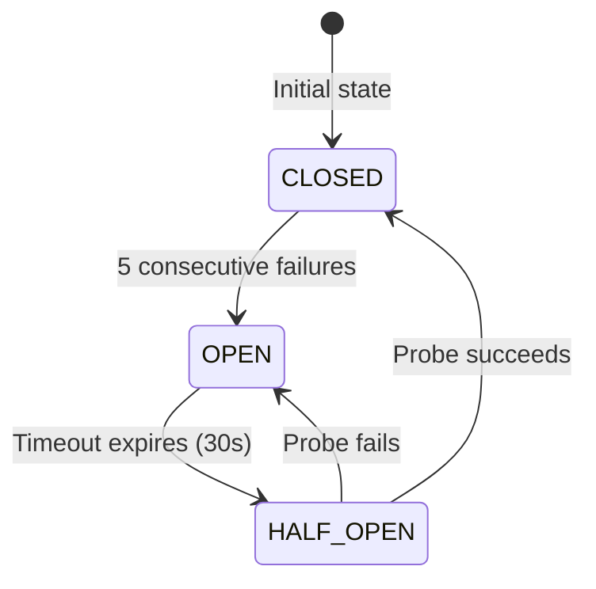

### Message Reliability

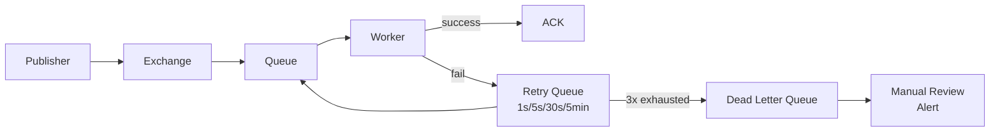

### Saga Compensations

| Step | Operation | Compensating Action |
|------|-----------|-------------------|
| 1 | Validate Transaction | Mark as `validation_failed` |
| 2 | Check Fraud | Mark as `fraud_check_failed` |
| 3 | Process Payment | Issue refund/void |
| 4 | Notify Result | Log failure to DLQ |

## CI/CD Pipeline

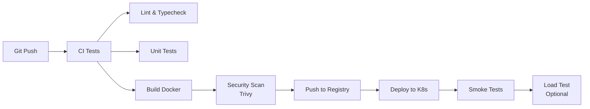

**Workflows (`.github/workflows/`):**

| Workflow | Trigger | Jobs |
|----------|---------|------|
| `ci-tests.yml` | PR to main | Lint, typecheck, unit tests (all services) |
| `docker-build.yml` | Push to main | Build & push all Docker images |
| `k8s-deploy.yml` | docker-build complete | Deploy to Kubernetes cluster |
| `security-scan.yml` | Weekly schedule | Trivy vulnerability scan |
| `load-test.yml` | Manual / Weekly | k6 performance + SLO validation |

**SLO Thresholds:**
- p95 response time < 500ms
- Error rate < 1%
- Checked automatically in CI

## PCI-DSS Compliance

| Requirement | Implementation |
|-------------|---------------|
| **3.4** Mask PAN | `maskCardNumber()` stores only `****` + last 4 |
| **3.2** Don't store sensitive auth data | CVV deleted after validation (`delete req.body.cardCvv`) |
| **4.1** Encrypt transmission | TLS everywhere (HTTPS, AMQPS, STUNNEL) |
| **7.1** Restrict access | API key authentication + HMAC signatures |
| **8.3** Strong authentication | API keys with least privilege |
| **10.2** Audit trails | All sensitive data access logged via Winston |
| **10.3** Log integrity | Centralized logging with timestamps and user IDs |
| **12.3** Security awareness | Automated key rotation via `RotationService` |

## Disaster Recovery

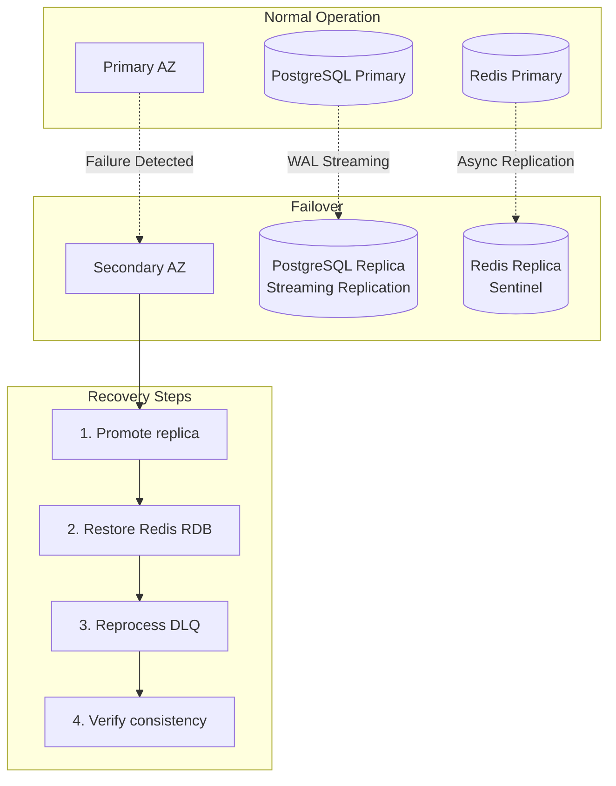

| Metric | Target |
|--------|--------|
| Recovery Time Objective (RTO) | 1 hour |
| Recovery Point Objective (RPO) | 5 minutes |
| Database Backups | WAL archiving + daily snapshots (30 days retention) |
| Redis Persistence | RDB snapshots every 5 minutes |
| Queue Durability | RabbitMQ queue definitions as code |

## Operational Runbook

### Health Checks

```bash
# All services
for port in 3000 3001 3002 8000 3004 8080; do
  curl -s -o /dev/null -w "%{http_code}" http://localhost:$port/health
  echo " :$port"
done
```

### Scaling

```bash
# Scale horizontally
docker compose up -d --scale transaction-processor=5
docker compose up -d --scale notification-service=3

# Check RabbitMQ consumer count
docker exec payment-rabbitmq rabbitmqctl list_queues name consumers
```

### Monitoring RabbitMQ

```bash
# Queue depths
docker exec payment-rabbitmq rabbitmqctl list_queues name messages messages_ready messages_unacknowledged

# Check for stuck messages in DLQ
docker exec payment-rabbitmq rabbitmqctl list_queues name arguments | grep dlq

# Purge DLQ (after investigation)
docker exec payment-rabbitmq rabbitmqctl purge_queue validation.dlq
```

### Redis Operations

```bash
# Check rate limit keys
docker exec payment-redis redis-cli KEYS "ratelimit:*" | wc -l

# Clear rate limits (if needed)
docker exec payment-redis redis-cli EVAL "return redis.call('del', unpack(redis.call('keys', ARGV[1])))" 0 "ratelimit:*"

# Monitor cache hit rate
docker exec payment-redis redis-cli INFO stats | grep -E "keyspace_hits|keyspace_misses"
```

### Full Reset

```bash
# WARNING: Deletes all data
docker compose down -v
docker compose up --build -d
```

## License

MIT
